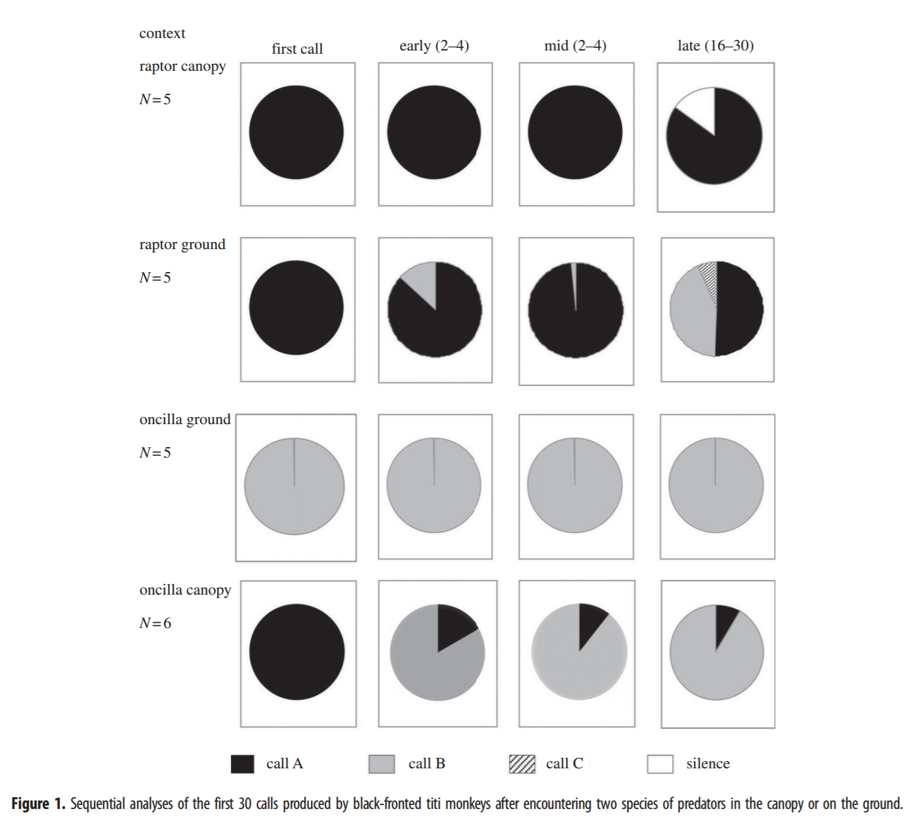
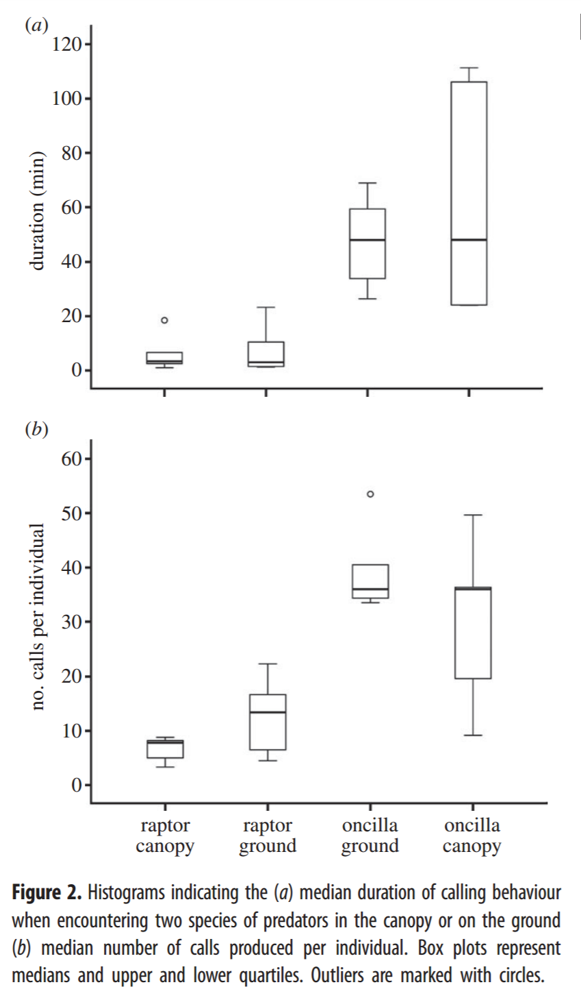

```{r setup, include=FALSE}
knitr::opts_chunk$set(
	echo = TRUE,
	warning = FALSE,
	comment = "##",
	prompt = TRUE,
	tidy = TRUE,
	tidy.opts = list(width.cutoff = 75),
	fig.path = "img/"
)
```
## DUE 2pm 2016-11-10

The objective of this assignment is to use your skills in ***R*** to replicate as closely as you can a set of statistical analyses and results reported in a paper of your choosing. You should have already selected and confirmed with me a paper for which you are going to replicate some of the analyses and you should have the data in hand.

You do not need to replicate ALL of the analysis presented in the paper (the more the better), but at minimum you need to repeat at least 3 analyses, including at least one descriptive statistical analysis or visualization and one inferential statistical analysis.

For this assignment, you should prepare several files to share with me via ***GitHub*** in a new repo called "data-reanalysis-assignment": [1] a PDF of the paper you are reanalyzing data from, [2] a ".csv" file with the original data for that paper as you either downloaded them as supplementary material or received them from the paper's author, and [3] an ".Rmd" file where you thoroughly describe and run the code for all of the steps in your reanalysis. I should be able to take the ".Rmd" file and knit it and produce a nicely formatted ".html" report describing what you did and seeing your results.

You should also embed in your ".Rmd" file, near your own results, any images of figures from the original paper that you replicate so that I can see them together. These should be included in a folder called "img" within your repo. You can include code like the following to reference files in your "img" folder for inclusion in your document.

``

Where you replace *imagename.filetype* with the name of your file, e.g., "figure-1.jpeg" and *###* with a integer number of pixels, e.g., width="200px"

If you include the headers above in this Rmd document (which lay out for ***R*** a particular set of instructions for knitting), then all of the figures associated with your chunks of code will be put into the "img" folder.

## Elements of Your Report:

You should start your reanalysis report with a short description of the study and of the specific data and reanalyses you will be doing, to orient your reader. Outline (briefly) the goal of the original paper, the data set used, and the analyses conducted, then describe which ones you will replicate. You should also demonstrate how you read in your datafile and show a few lines of raw data in your output (e.g., using `head()`).

I will be looking for you to clearly take your reader through all of the elements of data manipulation, analysis, and, if appropriate, visualization. You should provide as much coding detail, explanation, and output tables as necessary to compare your results to those published!

----


#Titi monkey call sequences vary with predator location and type 
### - by Cäsar, C., Zuberbühler, K., Young, R. J., & Byrne, R. W. [(2013)](http://rsbl.royalsocietypublishing.org/content/9/5/20130535.short). 


This paper investigates the alarm calls of the [black-fronted titi monkey](https://upload.wikimedia.org/wikipedia/commons/0/05/Callicebus_nigrifrons_Minas_Gerais.jpg). These small Neotropical primates are known to be hunted by a variety of animals, such as raptors, terrestrial carnovires, and snakes. In a previous study, which you can find [here](http://link.springer.com/article/10.1007/s00265-011-1313-0), Cäsar et al. established that the titis use two main call types upon encountering predators. Call type A is used upon encountering raptors whereas call type B is used when terrestrial predators are spotted. However, some data seemed to show that maybe these calls were not only predator-specific, but potentially reveal their location. In this study the authors explore this hypothesis by presenting the titi monkeys with two different predator types (oncilla vs. caracara) and elevations (terrestrial vs. aerial). (Even though caracaras do not seem likely predators, [suspected predation of an infant howler monkey](http://static1.1.sqspcdn.com/static/f/1200343/18198280/1337026355110/NP161_C.+plancus+and+A.+palliata_McKinney.pdf?token=lFo5i82vIBGBUSam1b76rBWjCYA%3D) has been reported.) 

The authors recorded the type of the first 30 calls uttered upon ecountering the oncilla or caracara models, the latency between calls, the duration of the alarm calling, and number of alarm calls per individual, and more (see datasets 'data1', 'data2', 'data3'.  

<table><tr><td><figcaption>Oncilla</figcaption></td><td><figcaption>Caracara</figcaption></td></tr></table>

The authors also recorded and uploaded the vocal response of the titi monkeys in reponse to each of the four testin conditions: ["Raptor on the ground"](http://rsbl.royalsocietypublishing.org/content/roybiolett/suppl/2013/08/29/rsbl.2013.0535.DC1/Raptor_on_the_ground_first_part.wav), ["Oncilla on the ground"](http://rsbl.royalsocietypublishing.org/content/roybiolett/suppl/2013/08/29/rsbl.2013.0535.DC1/Cat_on_the_ground.wav), ["Raptor in the canopy"](http://rsbl.royalsocietypublishing.org/content/roybiolett/suppl/2013/08/29/rsbl.2013.0535.DC1/Raptor_in_the_canopy.wav), ["Oncilla in the canopy"](http://rsbl.royalsocietypublishing.org/content/roybiolett/suppl/2013/08/29/rsbl.2013.0535.DC1/Cat_in_the_canopy.wav).

What I'll do next is take you through their results, step by step explaining how they analyzed their data - and why - and what the results from these analyses are.

##Loading the datasets!

Firstly, I'll load in all of the datasets that I will be using throughout my re-analysis. The original file was one Excel file with three sheets of data, here separated into three .csv files. The head(data#) code will show you the first section of these datasets. You can compare them to the original dataset, which you can find in my GitHub repository.
```{r}
library(curl)
f <- curl("https://raw.githubusercontent.com/Callicebus/Data-Reanalysis-Assignment2/master/CallType.csv")
data1 <- read.csv(f, header = TRUE, sep = ",", na.strings=c("","NA"), stringsAsFactors = TRUE)
head(data1)

f2 <- curl("https://raw.githubusercontent.com/Callicebus/Data-Reanalysis-Assignment2/master/CallInterval.csv")
data2 <- read.csv(f2, header = TRUE, sep = ",", stringsAsFactors = TRUE)
head(data2)

f3 <- curl("https://raw.githubusercontent.com/Callicebus/Data-Reanalysis-Assignment2/master/General.csv")
data3 <- read.csv(f3, header = TRUE, sep = ",", stringsAsFactors = TRUE)
head(data3)
```

##Pie charts
The first thing I'd like to do is replicate the pie charts in Figure 1. It will help us visualize the call types recorded. Even though I think bar charts are a better way of representing these data, I'll stick to pi charts because I haven't learned how to make those yet.
```{r}
#Step 1: I will pull the subsets of data from 'data1' that I need for createing the pie charts.rc will stand for Raptor in Canopy, rg for Raptor on Ground, oc for Oncilla in Canopy, og for Oncilla on Ground. 

#Raptor in Canopy
rc1 <- data1[1:5,3] #Subsetting only the first call of 'raptor in canopy' (rc) part of the dataset.
rc.count1 <- table(unlist(rc1)) #Counting the caterogical data for the first call
rcc1 <- as.data.frame(rc.count1)
rcc1 <- rcc1[!(rcc1$Var1=="O"),] #Removing calls identified as "Other" and thus not alarm calls.

rc2 <- data1[c(1:5), c(4:6)] #Subsetting second to fourth call of 'raptor in canopy' part of dataset.
rc.count2<-table(unlist(rc2))
rcc2 <- as.data.frame(rc.count2)
rcc2 <- rcc2[!(rcc2$Var1=="O"),]

rc3 <- data1[c(1:5), c(7:17)] #Subsetting call 5 to 15 of 'raptor in canopy'.
rc.count3 <- table(unlist(rc3))
rcc3 <- as.data.frame(rc.count3)
rcc3 <- rcc3[!(rcc3$Var1=="O"),]

rc4 <- data1[c(1:5), c(18:32)] #Subsetting call 16 to 30 of 'raptor in canopy'.
rc.count4 <- table(unlist(rc4))
rcc4 <- as.data.frame(rc.count4)
rcc4 <- rcc4[!(rcc4$Var1=="O"),]


#Raptor on Ground
rg1 <- data1[6:12,3]
rg.count1 <- table(unlist(rg1))
rgc1 <- as.data.frame(rg.count1)
rgc1 <- rgc1[!(rgc1$Var1=="O"),]

rg2 <- data1[c(6:12), c(4:6)]
rg.count2<-table(unlist(rg2))
rgc2 <- as.data.frame(rg.count2)
rgc2 <- rgc2[!(rgc2$Var1=="O"),]

rg3 <- data1[c(6:12), c(7:17)] 
rg.count3 <- table(unlist(rg3))
rgc3 <- as.data.frame(rg.count3)
rgc3 <- rgc3[!(rgc3$Var1=="O"),]

rg4 <- data1[c(6:12), c(18:32)]
rg.count4 <- table(unlist(rg4))
rgc4 <- as.data.frame(rg.count4)
rgc4 <- rgc4[!(rgc4$Var1=="O"),]
colnames(rgc4) <- c("Call","Freq") # I want to only have a legend with the last pie chart, it is redundant to have one at each chart. However, I want the frst column to be called 'CallType' rather than 'Var1'.

#Oncilla on Ground
og1 <- data1[13:17,3] 
og.count1 <- table(unlist(og1)) 
ogc1 <- as.data.frame(og.count1)
ogc1 <- ogc1[!(ogc1$Var1=="O"),]

og2 <- data1[c(13:17), c(4:6)] 
og.count2<-table(unlist(og2))
ogc2 <- as.data.frame(og.count2)
ogc2 <- ogc2[!(ogc2$Var1=="O"),]

og3 <- data1[c(13:17), c(7:17)]
og.count3 <- table(unlist(og3))
ogc3 <- as.data.frame(og.count3)
ogc3 <- ogc3[!(ogc3$Var1=="O"),]

og4 <- data1[c(13:17), c(18:32)]
og.count4 <- table(unlist(og4))
ogc4 <- as.data.frame(og.count4)
ogc4 <- ogc4[!(ogc4$Var1=="O"),]


#Oncilla in Canopy
oc1 <- data1[18:23,3] 
oc.count1 <- table(unlist(oc1)) 
occ1 <- as.data.frame(oc.count1)
occ1 <- occ1[!(occ1$Var1=="O"),]

oc2 <- data1[c(18:23), c(4:6)] 
oc.count2<-table(unlist(oc2))
occ2 <- as.data.frame(oc.count2)
occ2 <- occ2[!(occ2$Var1=="O"),]

oc3 <- data1[c(18:23), c(7:17)]
oc.count3 <- table(unlist(oc3))
occ3 <- as.data.frame(oc.count3)
occ3 <- occ3[!(occ3$Var1=="O"),]

oc4 <- data1[c(18:23), c(18:32)]
oc.count4 <- table(unlist(oc4))
occ4 <- as.data.frame(oc.count4)
occ4 <- occ4[!(occ4$Var1=="O"),]
```


```{r}
#Step 2: Creating pie charts for each of the subsets of data. Underneath this chunk of code you'll find the original Figure 1 for comparison.

library(ggplot2)
library(gridExtra)
library(cowplot) # The package 'cowplot' is an extension of ggplot2 and helps you create graphs that are ready for publication!

# This function below helps me to pull a legend from the pie.rg4 chart, save that separately as a grob in 'legend', so I can add it underneath all pie charts with the code grid.arrange() later on!
library(gridExtra)
get_legend<-function(myggplot){
  tmp <- ggplot_gtable(ggplot_build(myggplot))
  leg <- which(sapply(tmp$grobs, function(x) x$name) == "guide-box")
  legend <- tmp$grobs[[leg]]
  return(legend)
}

#This code below makes sure that Type A calls are always colored black, Type B calls always dark grey, etc.
myPalette <- c("A" = "black","B" = "darkgrey","C" = "grey", "S" = "white") 

#Pie charts for 'Raptor in Canopy'.
pie.rc1 <- ggplot(rcc1, aes(x="", y=Freq, fill=Var1)) + geom_bar(width = 1, stat = "identity") + coord_polar("y", start=0) + theme(legend.position = "none", axis.title.x=element_blank(), axis.title.y=element_blank(), axis.text = element_blank(), axis.ticks = element_blank(), panel.grid  = element_blank(), panel.background = element_rect(colour = "black")) + scale_fill_manual(values = myPalette) + ggtitle("first call")

pie.rc2 <- ggplot(rcc2, aes(x="", y=Freq, fill=Var1)) + geom_bar(width = 1, stat = "identity") + coord_polar("y", start=0) + theme(legend.position = "none", axis.title.x=element_blank(), axis.title.y=element_blank(), axis.text = element_blank(), axis.ticks = element_blank(), panel.grid  = element_blank(), panel.background = element_rect(colour = "black")) + scale_fill_manual(values = myPalette) + ggtitle("early (2-4)")

pie.rc3 <- ggplot(rcc3, aes(x="", y=Freq, fill=Var1)) + geom_bar(width = 1, stat = "identity") + coord_polar("y", start=0) + theme(legend.position = "none", axis.title.x=element_blank(), axis.title.y=element_blank(), axis.text = element_blank(), axis.ticks = element_blank(), panel.grid  = element_blank(), panel.background = element_rect(colour = "black")) + scale_fill_manual(values = myPalette) + ggtitle("mid (5-15)")

pie.rc4 <- ggplot(rcc4, aes(x="", y=Freq, fill=Var1)) + geom_bar(width = 1, stat = "identity") + coord_polar("y", start=0) + theme(legend.position = "none", axis.title.x=element_blank(), axis.title.y=element_blank(), axis.text = element_blank(), axis.ticks = element_blank(), panel.grid  = element_blank(), panel.background = element_rect(colour = "black")) + scale_fill_manual(values = myPalette) + ggtitle("late (16-30)")


#Pie charts for 'Raptor on Ground'.
pie.rg1 <- ggplot(rgc1, aes(x="", y=Freq, fill=Var1)) + geom_bar(width = 1, stat = "identity") + coord_polar("y", start=0) + theme(legend.position = "none", axis.title.x=element_blank(), axis.title.y=element_blank(), axis.text = element_blank(), axis.ticks = element_blank(), panel.grid  = element_blank(), panel.background = element_rect(colour = "black")) + scale_fill_manual(values = myPalette)

pie.rg2 <- ggplot(rgc2, aes(x="", y=Freq, fill=Var1))+
geom_bar(width = 1, stat = "identity")+
  coord_polar("y", start=0) + theme(legend.position = "none", axis.title.x=element_blank(), axis.title.y=element_blank(), axis.text = element_blank(), axis.ticks = element_blank(), panel.grid  = element_blank(), panel.background = element_rect(colour = "black")) + scale_fill_manual(values = myPalette)

pie.rg3 <- ggplot(rgc3, aes(x="", y=Freq, fill=Var1)) + geom_bar(width = 1, stat = "identity")+ coord_polar("y", start=0) + theme(legend.position = "none", axis.title.x=element_blank(), axis.title.y=element_blank(), axis.text = element_blank(), axis.ticks = element_blank(), panel.grid  = element_blank(), panel.background = element_rect(colour = "black")) + scale_fill_manual(values = myPalette)

pie.rg4 <- ggplot(rgc4, aes(x="", y=Freq, fill=Call)) + geom_bar(width = 1, stat = "identity") + coord_polar("y", start=0) + theme(legend.position = "bottom", axis.title.x=element_blank(), axis.title.y=element_blank(), axis.text = element_blank(), axis.ticks = element_blank(), panel.grid  = element_blank(), panel.background = element_rect(colour = "black")) + scale_fill_manual(values = myPalette)
legend <- get_legend(pie.rg4)
pie.rg4 <- pie.rg4 + theme(legend.position = "none")


#Pie charts 'Oncilla on Ground'
pie.og1 <- ggplot(ogc1, aes(x="", y=Freq, fill=Var1)) + geom_bar(width = 1, stat = "identity") + coord_polar("y", start=0) + theme(legend.position = "none", axis.title.x=element_blank(), axis.title.y=element_blank(), axis.text = element_blank(), axis.ticks = element_blank(), panel.grid  = element_blank(), panel.background = element_rect(colour = "black")) + scale_fill_manual(values = myPalette)

pie.og2 <- ggplot(ogc2, aes(x="", y=Freq, fill=Var1)) + geom_bar(width = 1, stat = "identity") + coord_polar("y", start=0) + theme(legend.position = "none", axis.title.x=element_blank(), axis.title.y=element_blank(), axis.text = element_blank(), axis.ticks = element_blank(), panel.grid  = element_blank(), panel.background = element_rect(colour = "black")) + scale_fill_manual(values = myPalette)

pie.og3 <- ggplot(ogc3, aes(x="", y=Freq, fill=Var1)) + geom_bar(width = 1, stat = "identity")+ coord_polar("y", start=0) + theme(legend.position = "none", axis.title.x=element_blank(), axis.title.y=element_blank(), axis.text = element_blank(), axis.ticks = element_blank(), panel.grid  = element_blank(), panel.background = element_rect(colour = "black")) + scale_fill_manual(values = myPalette)

pie.og4 <- ggplot(ogc4, aes(x="", y=Freq, fill=Var1)) + geom_bar(width = 1, stat = "identity") + coord_polar("y", start=0) + theme(legend.position = "none", axis.title.x=element_blank(), axis.title.y=element_blank(), axis.text = element_blank(), axis.ticks = element_blank(), panel.grid  = element_blank(), panel.background = element_rect(colour = "black")) + scale_fill_manual(values = myPalette)


#Pie charts 'Oncilla in Canopy'
pie.oc1 <- ggplot(occ1, aes(x="", y=Freq, fill=Var1)) + geom_bar(width = 1, stat = "identity") + coord_polar("y", start=0) + theme(legend.position = "none", axis.title.x=element_blank(), axis.title.y=element_blank(), axis.text = element_blank(), axis.ticks = element_blank(), panel.grid  = element_blank(), panel.background = element_rect(colour = "black")) + scale_fill_manual(values = myPalette)

pie.oc2 <- ggplot(occ2, aes(x="", y=Freq, fill=Var1)) + geom_bar(width = 1, stat = "identity") + coord_polar("y", start=0) + theme(legend.position = "none", axis.title.x=element_blank(), axis.title.y=element_blank(), axis.text = element_blank(), axis.ticks = element_blank(), panel.grid  = element_blank(), panel.background = element_rect(colour = "black")) + scale_fill_manual(values = myPalette)

pie.oc3 <- ggplot(occ3, aes(x="", y=Freq, fill=Var1)) + geom_bar(width = 1, stat = "identity")+ coord_polar("y", start=0) + theme(legend.position = "none", axis.title.x=element_blank(), axis.title.y=element_blank(), axis.text = element_blank(), axis.ticks = element_blank(), panel.grid  = element_blank(), panel.background = element_rect(colour = "black")) + scale_fill_manual(values = myPalette)

pie.oc4 <- ggplot(occ4, aes(x="", y=Freq, fill=Var1)) + geom_bar(width = 1, stat = "identity") + coord_polar("y", start=0) + theme(legend.position = "none", axis.title.x=element_blank(), axis.title.y=element_blank(), axis.text = element_blank(), axis.ticks = element_blank(), panel.grid  = element_blank(), panel.background = element_rect(colour = "black")) + scale_fill_manual(values = myPalette)

#I'd like to get all 16 pie charts in a row, like in Figure 1 of the article.

totalplot <- plot_grid(pie.rc1, pie.rc2, pie.rc3, pie.rc4, pie.rg1, pie.rg2, pie.rg3, pie.rg4, pie.og1, pie.og2, pie.og3, pie.og4, pie.oc1, pie.oc2, pie.oc3, pie.oc4, labels=c("Raptor Canopy", " ", " ", " ", "Raptor Ground", " ", " ", " ", "Oncilla Ground", " ", " ", " ", "Oncilla Canopy", " "," "," ", ncol = 4, nrow = 4), label_size = 10, hjust = -0.5, vjust = 10.5)

grid.arrange(totalplot, legend, nrow = 2, heights = c(30, 2))

```

If I'd had more time (i.e. started this assignment earlier...) I would have liked to find out how I can make sure the graph title on the top 4 pie charts doesn't affect the size of the charts (they are currently slightly smaller than the rest due to title placement). 
For comparison below you'll see Figure 1 as published in the article.




##G-test
```{r
library(DescTools)
observed <- c(5,5, 4,0) #Observed frequencies
expected <- c(90/14,50/14,36/14,20/14) #Expected proportions
chisq.test(x=observed, y=expected)
```


##Replicating Figure 2 & Friedman Test
```{r}
data3$Stimulus = factor(data3$Stimulus, unique(data3$Stimulus)) #This snippet of code makes R follow the order in which the 4 test conditions appear in the data. Without this code, my boxplots were ordered alphabetically, and thus organized exactly opposite of what was shown in Figure 2 in the article.

boxplot <- ggplot(data3[1:20,], aes(Stimulus, Dur.MIN)) + geom_boxplot() + theme(axis.text.x = element_text(angle=0), panel.background = element_rect(fill = 'white'), axis.line.x = element_line(color="black", size = 0.5), axis.line.y = element_line(color="black", size = 0.5), legend.position = "none", axis.title.x=element_blank()) + scale_y_continuous(breaks=seq(0,120,20)) + labs(y = "duration (min)")

boxplot2 <- ggplot(data3[1:20,], aes(Stimulus, calls.ind)) + geom_boxplot() + theme(axis.text.x = element_text(angle=0), panel.background = element_rect(fill = 'white'), axis.line.x = element_line(color="black", size = 0.5), axis.line.y = element_line(color="black", size = 0.5)) + scale_y_continuous(breaks=seq(0,60,10)) + labs(y = "no. calls per individual")

plot_grid(boxplot, boxplot2, labels=c("(a)", "(b)"), ncol = 1, nrow = 2)
```



```{r}
data3.1 <- data3[-c(21:23), ]
data3.1$Stimulus <- factor(data3.1$Stimulus) #Friedman Test does not work if you don't change your group and block variables into factors. 
data3.1$Group <- factor(data3.1$Group)
friedman.test(data3.1$Dur.MIN ~ Stimulus|Group, data3.1) 
```

This first Friedman Test gets me the same X2 value as in the paper, but my p-value of 0.006 is different than their 0.001. I'm not sure why, as the graphs and X2 values do match up.

```{r}
friedman.test(data3.1$calls.ind ~ Stimulus|Group, data3.1)

```
Same issue here, all data match up except for the p-value.

##Wilcoxon Rank Tests
```{r}
library(coin)
raptor.dur <- c(data3.1$Dur.MIN[1:10])
raptor.dur
oncilla.dur <- c(data3.1$Dur.MIN[11:20])
oncilla.dur
wilcoxsign_test(raptor.dur ~ oncilla.dur, distribution="exact")
```

```{r}
canopy.dur <- c(data3.1$Dur.MIN[1:5], data3.1$Dur.MIN[16:20])
ground.dur <- c(data3.1$Dur.MIN[6:10], data3.1$Dur.MIN[11:15])
wilcoxsign_test(canopy.dur ~ ground.dur, distribution="exact")

```

```{r

#raptor.dur <- c(data3.1$Dur.MIN[1:10])
#raptor.dur
#oncilla.dur <- c(data3.1$Dur.MIN[11:20])
#oncilla.dur

#rate <- c(data3.1$calls.ind)
#rate

#wilcox.test(raptor.dur, oncilla.dur, paired = FALSE)

pred.type <- c(rep(1, 10), rep(2, 10))
pred.type

pred.loc <- c(rep(1, 5), rep(2, 5), rep(1, 5), rep(2, 5))
pred.loc

data3.1 <- cbind(data3.1, pred.type, pred.loc)
data3.1

wtest <- wilcox.test(Dur.MIN~pred.loc,data=data3.1, alternative="greater")
qnorm(wtest$p.value)

```